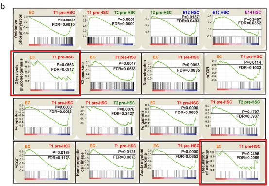
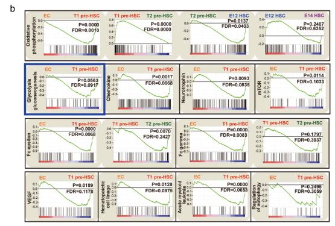

## Correction: Extended Data Fig. 5b

*Article paper: Tracing haematopoietic stem cell formation at single-cell resolution (doi:10.1038/nature17997)*

- In the original Extended Data Fig. 5b of this Article, the GSEA panel of “Glycolysis gluconeogenesis” was inadvertently duplicated from the panel of “Regulation of autophagy” (**Fig. 1**, indicated by red box). 

- After carefully checking the raw data in originally submitted Supplementary Table 9 (which is related to the mentioned panel and presented correctly), this figure has been corrected now (**Fig. 2**, indicated by blue box). This error does not alter the results or conclusions of the Article. 

Fig. 1 | Inadvertently duplicated of indicated panels in the original Extended Data Fig. 5b.

Fig. 2 | The corrected version of Extended Data Fig. 5b.

